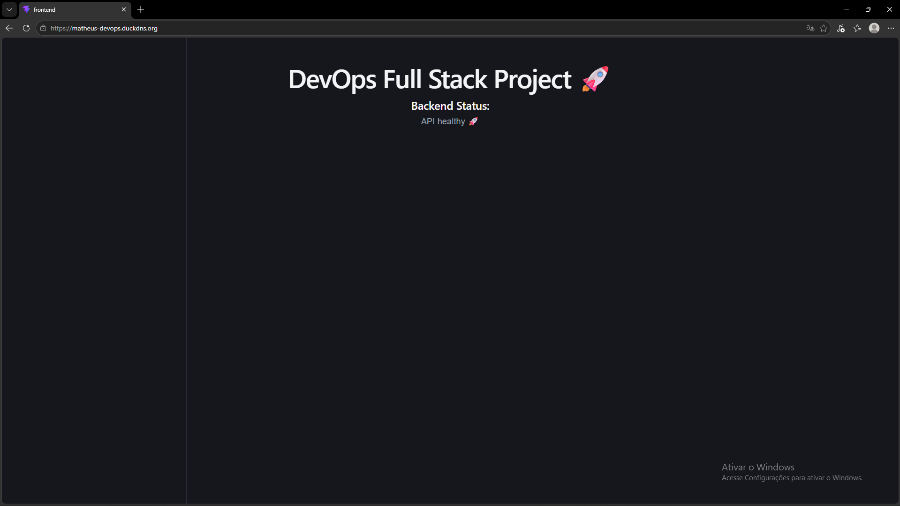

# DevOps Full Stack Project


Production-style full stack deployment running on AWS EC2 using Docker, Nginx, React, and Node.js.

---

## Infrastructure

```text
Internet
   ↓
Nginx Reverse Proxy
   ↓
React Frontend
   ↓
Express API
   ↓
Docker Containers
   ↓
AWS EC2 Ubuntu Server
```


---

## Application Preview



---

## Stack

### Frontend

* React
* Vite

### Backend

* Node.js
* Express

### DevOps & Cloud

* Docker
* Docker Compose
* Nginx
* AWS EC2
* Linux
* DuckDNS

---

## Features

* Reverse proxy with Nginx
* Dockerized backend
* Production frontend build
* REST API integration
* Cloud deployment on AWS
* Health check endpoint
* Environment variables

---

## Live Demo

```text
http://matheus-devops.duckdns.org
```

---

## Local Setup

```bash
git clone https://github.com/Matheus-ferreira97/devops-fullstack-project.git

cd devops-fullstack-project

sudo docker compose up -d --build
```

---

## Health Check

```bash
/api/health
```

Response:

```json
{
  "status": "OK",
  "message": "API healthy 🚀"
}
```

---

## Next Improvements

* CI/CD with GitHub Actions
* HTTPS with Let's Encrypt
* PostgreSQL integration
* Terraform
* Kubernetes
* Monitoring

```
```
